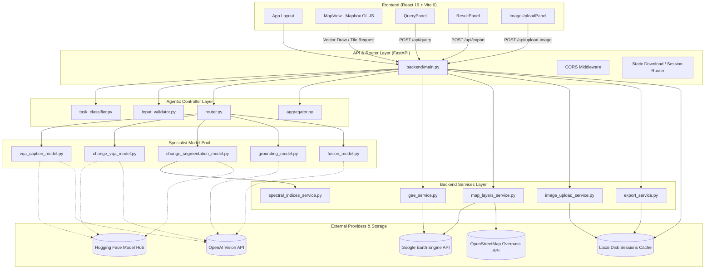

# 01 — System Architecture

## Architectural Pattern
SatQuery AI adheres to a **Decoupled Controller-Specialist-Aggregator** pattern layered over a modern asynchronous REST service and a reactive client SPA:

---

## Subsystem Breakdown

### 1. Presentation & Interaction Subsystem (`frontend/src/`)
* **Framework:** React 19 running on Vite 6.
* **Responsibilities:**
  - Rendering satellite tile basemaps with `@mapbox/mapbox-gl-draw` polygon manipulation.
  - Synchronizing user ROI state, dual-date ranges, modality selectors (`optical`, `sar`, `both`), and query input.
  - Dynamically rendering vector layers (water, vegetation, roads, buildings) and bounding box evidence.
  - Presenting structured execution traces, confidence meters, and multi-format download triggers.

### 2. API Gateway & Session Coordinator (`backend/main.py`)
* **Framework:** FastAPI with Uvicorn ASGI server.
* **Responsibilities:**
  - Exposes REST endpoints conforming to OpenAPI / JSON Schema standards.
  - Enforces CORS policies (`localhost:5173`, `localhost:3000`, `localhost:4173`).
  - Manages session lifecycle by generating UUID-based directories in `./sessions/{session_id}/` to persist session manifests, thumbnails, rasters, and exported artifacts.

### 3. Agentic Controller Subsystem (`backend/controller/`)
* **Module 1 — `task_classifier.py`:** Evaluates input queries using keyword matrices and intent rules to classify tasks into:
  - `vqa`: Single-image visual question answering.
  - `caption`: Scene summary and description.
  - `grounding`: Spatial localization of queried objects.
  - `change_vqa`: Multi-date comparative analysis.
  - `fusion`: Joint optical + SAR radar analysis.
* **Module 2 — `input_validator.py`:** Enforces pre-conditions (e.g. verifying two epochs exist for change queries, checking GeoJSON geometry validity, warning on cloud cover).
* **Module 3 — `router.py`:** Instantiates specialist models once at startup, provides model warmup lifecycle routines, and routes tasks to the appropriate specialist model.
* **Module 4 — `aggregator.py`:** Combines raw specialist responses, derives calibrated confidence scores, extracts GeoJSON evidence collections, and generates natural-language execution traces.

### 4. Specialist Model Subsystem (`backend/models/`)
* Standardized under the `SpecialistModel` abstract base class (`base_model.py`).
* Implements lazy-loading PEFT / QLoRA adapters from Hugging Face (`mokshda/satquery-ai-...`) with seamless fallback to multimodal LLM vision prompting and deterministic geometric/spectral calculators.

### 5. Services & Geospatial Processing Subsystem (`backend/services/`)
* **`gee_service.py`:** Handles GEE authentication (via service account key or default credentials), queries `COPERNICUS/S2_SR_HARMONIZED` and `COPERNICUS/S1_GRD`, applies QA60 cloud bitmasks, and generates PNG thumbnails.
* **`spectral_indices_service.py`:** Calculates NDVI, NDWI, NDBI, and SAR ratios, and performs pixel-level change analysis.
* **`map_layers_service.py`:** Fetches on-demand thematic vector layers from ESA WorldCover (10m vegetation), JRC Surface Water (10m water), Google Open Buildings v3, and OpenStreetMap.
* **`image_upload_service.py`:** Processes user-uploaded GeoTIFFs using `rasterio`, reprojects bounds to EPSG:4326 (WGS-84), extracts 4-corner coordinates for Mapbox canvas overlays, and builds RGB previews.
* **`export_service.py`:** Compiles session results into formatted PDF reports (`reportlab`), GeoJSON vector files, GeoTIFF patches, and JSON execution logs.

---

## Subsystem Communication Matrix

| Source Component | Target Component | Protocol | Data Transferred | Authentication | Error Handling Strategy |
|---|---|---|---|---|---|
| **Frontend UI** | **FastAPI Gateway** | HTTP / JSON | GeoJSON ROI, date strings, modality, query text, upload bytes | None (CORS protected) | Axios error interceptor displays error card with troubleshooting checklist |
| **Gateway** | **Controller Layer** | In-Process Python Call | Pydantic Request DTOs, image references, metadata dict | Internal | Pydantic `ValidationError` & `InputValidationError` return HTTP 422 |
| **Router** | **Specialist Models** | In-Process Python Call | Resolved image arrays/paths, query, metadata | Internal | Model exceptions caught; router falls back to multi-tier prompt/heuristics |
| **Specialist Models** | **Hugging Face Hub** | HTTPS / REST | Model checkpoints, LoRA adapter `.safetensors` | Bearer Token (`HF_TOKEN`) | Catches network/CUDA errors, logs warning, uses VLM/spectral fallback |
| **GEE Service** | **Google Earth Engine** | HTTPS / gRPC | ROI bounds, date filter, cloud mask expressions | Service Account Key JSON / OAuth | Catches `ee.EEException`, falls back to local raster processing or warnings |
| **Map Layers Service** | **OSM Overpass API** | HTTPS / POST | Overpass QL bounding box query | None (Public API) | Catches timeout/HTTP errors, returns empty GeoJSON with warning |
| **Specialist Models** | **OpenAI API** | HTTPS / JSON | Multimodal remote-sensing prompts + imagery context | API Key (`OPENAI_API_KEY`) | Catches 429 quota/network errors, falls back to deterministic domain knowledge |
