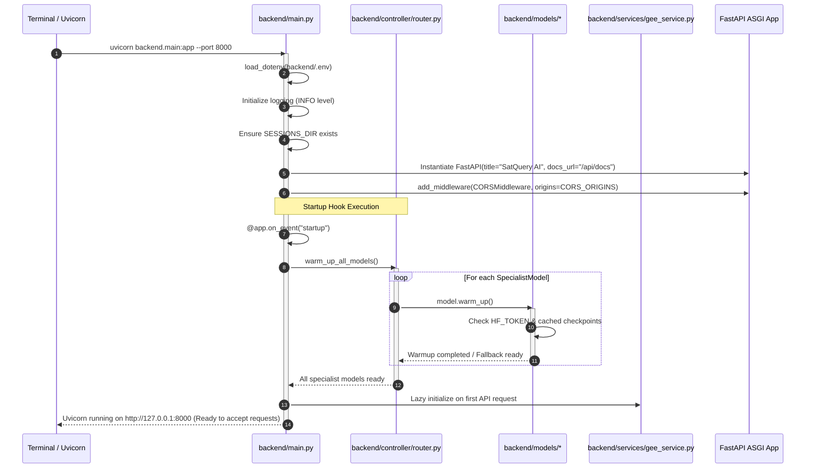

# 06 — Application Startup Lifecycle

## Startup Flow Trace



---

## Detailed Step-by-Step Startup Sequence

### Step 1: Python Environment & `.env` Loading (`backend/main.py:29-30`)
* `dotenv.load_dotenv()` runs before any submodules are imported.
* Reads variables from `backend/.env` into `os.environ`.

### Step 2: Logging & Directory Initialization (`backend/main.py:58-70`)
* Configures logging format: `%(asctime)s [%(levelname)s] %(name)s: %(message)s`.
* Resolves `_SESSIONS_DIR` (`./sessions` by default) and ensures the directory path exists on disk using `mkdir(parents=True, exist_ok=True)`.

### Step 3: FastAPI Application Construction (`backend/main.py:84-102`)
* Creates the `FastAPI` instance with title `"SatQuery AI"`, version `"0.1.0"`, and API docs at `/api/docs`.
* Attaches `CORSMiddleware` with origins resolved from `CORS_ORIGINS` to allow browser cross-origin requests from Vite development ports (`5173`, `3000`, `4173`).

### Step 4: Model Registry & Warmup Routine (`backend/main.py:108-113`, `backend/controller/router.py:42-49`)
* During module load, `router.py` initializes singletons of the 5 specialist models:
  ```python
  _vqa_caption = VQACaptionModel()
  _grounding   = GroundingModel()
  _change_vqa  = ChangeVQAModel()
  _fusion      = FusionModel()
  _change_seg  = ChangeSegmentationModel()
  ```
* In the `@app.on_event("startup")` lifecycle hook, `warm_up_all_models()` executes on each instance. Each model attempts to connect to the Hugging Face Hub, check local cached weights, or prepare inference pipeline fallbacks.

### Step 5: Route Registration & Server Readiness (`backend/main.py`)
* Endpoints are registered:
  - `GET /healthz`: Immediate health check endpoint.
  - `POST /api/roi/fetch-imagery`: Google Earth Engine retrieval.
  - `POST /api/upload-image`: Rasterio upload processor.
  - `POST /api/query`: Agentic analysis pipeline.
  - `GET /api/layers/{layer_name}`: Dynamic vector map layers.
  - `POST /api/export`: Session export generator.
  - `GET /api/download/{session_id}/{filename}`: Artifact file server.
* Uvicorn opens socket on port 8000 and begins listening for HTTP requests.

---

## Frontend Startup Sequence (`frontend/`)
1. **Entry Mounting (`frontend/src/main.jsx`):** React 19 creates the root DOM node at `#root` and renders `<App />`.
2. **Health Check (`frontend/src/App.jsx:62-67`):** App triggers an initial `fetch('/healthz')` to verify that the FastAPI backend is running, displaying a backend status pill in the top header.
3. **Map Initialization (`frontend/src/components/MapView.jsx:165-245`):**
   - Validates `VITE_MAPBOX_TOKEN`.
   - Mounts `mapboxgl.Map` with satellite style `mapbox://styles/mapbox/satellite-streets-v12`.
   - Attaches `@mapbox/mapbox-gl-draw` polygon controls to the top-right corner.
   - Registers event listeners for `draw.create`, `draw.update`, and `draw.delete` to sync drawn ROI coordinates to parent state.
