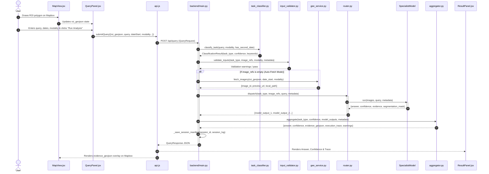

# 07 — Complete Data Flow

## End-to-End Query Analysis Flow



---

## Data Transformations Throughout the Pipeline

### 1. Ingestion Phase
* **Input:** Raw user inputs from React form (`query: string`, `dateStart: YYYY-MM-DD`, Mapbox polygon GeoJSON).
* **Format:**
  ```json
  {
    "type": "Polygon",
    "coordinates": [[[75.80, 26.90], [75.82, 26.90], [75.82, 26.92], [75.80, 26.92], [75.80, 26.90]]]
  }
  ```

### 2. Validation & Preprocessing Phase
* `Pydantic` validates regex dates (`^\d{4}-\d{2}-\d{2}$`) and geometry type (`Polygon` / `MultiPolygon`).
* `input_validator.py` checks spatial bounding box extent, date chronology (`date_start < date_end`), and epoch parity for bi-temporal tasks.

### 3. Imagery Fetching Phase
* `gee_service.py` projects GeoJSON coordinates into an `ee.Geometry.Polygon`.
* Sentinel-2 Level-2A surface reflectance (`COPERNICUS/S2_SR_HARMONIZED`) is filtered by bounds, date, and `<20%` cloud coverage.
* QA60 cloud bitmask is applied; visual bands `B4`, `B3`, `B2` are median-composited and visual thumbnail URLs / GeoTIFFs are created.

### 4. Specialist Reasoning & Spectral Modeling
* **Optical / SAR Processing:** Multispectral arrays are ingested by `vqa_caption_model.py` or `fusion_model.py`.
* **Spectral Index Analysis:** `spectral_indices_service.py` computes $\Delta NDVI$, $\Delta NDWI$, $\Delta NDBI$, and pixel shift masks.
* **Spatial Projection:** `grounding_model.py` translates normalized coordinates $[ymin, xmin, ymax, xmax]$ into geographic WGS84 bounding polygons $[min\_lon, min\_lat, max\_lon, max\_lat]$.

### 5. Aggregation & Trace Formatting Phase
* `aggregator.py` combines text answers, scales confidence by task classification certainty, compiles GeoJSON `FeatureCollection` evidence, and generates an auditable execution trace.

### 6. Persistence & Presentation Phase
* Stored to disk: `./sessions/{session_id}/session.json`.
* Returned to client as `QueryResponse`:
  ```json
  {
    "session_id": "2feff571-3f5f-4e7c-ba7d-19087d23b6ff",
    "task_type": "change_vqa",
    "answer": "Comparative analysis reveals new_construction in the central sector...",
    "confidence": 0.84,
    "evidence_geojson": { "type": "FeatureCollection", "features": [...] },
    "execution_trace": [
      { "step": "task_classification", "detail": { "task_type": "change_vqa" } },
      { "step": "model_dispatch", "detail": { "models_called": ["change_vqa", "change_segmentation"] } }
    ]
  }
  ```
* React updates `<ResultPanel />` and Mapbox injects the evidence vector layer into the map canvas.
