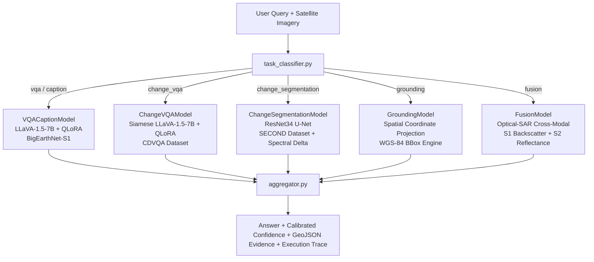

# 13 — AI & Machine Learning Components Deep Dive

## Architecture Overview
SatQuery AI does not rely on a monolithic mega-model. Instead, it utilizes an **Agentic Specialist Routing Architecture** combining parameter-efficient fine-tuned (PEFT) Vision-Language Models, convolutional segmentation networks, multimodal LLM fallbacks, and deterministic remote sensing spectral engines.

---

## Specialist Model Deep Dive

### 1. `VQACaptionModel` (`backend/models/vqa_caption_model.py`)
* **Task:** Visual Question Answering and scene captioning for single remote-sensing images.
* **Base Architecture:** `llava-hf/llava-1.5-7b-hf` (Vision Transformer `CLIP-ViT-L/14` + Linear Projection + `Llama-2-7B` LLM).
* **Adaptation Method:** 4-bit NormalFloat (`nf4`) QLoRA fine-tuning using `peft` and `bitsandbytes` on Sentinel-1 SAR imagery (`javidtheimmortal/bigearthnetsentinel1`).
* **Hugging Face Hub Repository:** `mokshda/satquery-ai-vqa-lora`
* **LoRA Target Modules:** `["q_proj", "k_proj", "v_proj", "o_proj"]` ($r=16, \alpha=32$).
* **Inference Pipeline:**
  1. Lazily loads 4-bit quantized base weights into VRAM.
  2. Applies LoRA adapter overlays via `PeftModel.from_pretrained()`.
  3. Preprocesses image array using `AutoProcessor` and formats multi-turn chat template: `USER: <image>\n{query}\nASSISTANT:`.
  4. Generates autoregressive text answer with temperature sampling disabled (`do_sample=False`).
* **Fallback Strategy:** If local GPU VRAM is unavailable or weights are loading, dispatches to multimodal GPT-4o-mini with domain-adapted remote sensing prompts, falling back to deterministic land-cover summaries if quota limits are exceeded.

---

### 2. `ChangeVQAModel` (`backend/models/change_vqa_model.py`)
* **Task:** Bi-temporal semantic change description and question answering (comparing Date 1 vs. Date 2).
* **Architecture:** Bi-temporal concatenated Siamese `LLaVA-1.5-7B` with QLoRA.
* **Hugging Face Hub Repository:** `mokshda/satquery-ai-change-vqa`
* **Training Dataset:** CDVQA (Change Detection Visual Question Answering).
* **Input Representation:**
  - Before image ($T_1$) and After image ($T_2$) are resized to $224 \times 224$ and concatenated side-by-side into a single $448 \times 224$ RGB image.
  - Formats conversational context: `[Before ({date1}) | After ({date2})] {query}`.

---

### 3. `ChangeSegmentationModel` (`backend/models/change_segmentation_model.py`)
* **Task:** Multi-class pixel-level semantic change detection.
* **Architecture:** 6-channel input `ResNet34 U-Net` via `segmentation-models-pytorch`.
* **Hugging Face Hub Repository:** `mokshda/satquery-ai-change-segmentation`
* **Target Change Classes:**
  1. `0: no_change`
  2. `1: new_construction` (Red: `#FF4444`)
  3. `2: demolition` (Orange: `#FF8800`)
  4. `3: vegetation_growth` (Green: `#44BB44`)
  5. `4: deforestation` (Brown: `#886600`)
* **Spectral Delta Engine Integration:**
  - Ingests `backend/services/spectral_indices_service.py` to calculate exact pixel area percentages ($\% \text{ Area}$) and generate spatial GeoJSON polygons for the Mapbox overlay.

---

### 4. `GroundingModel` (`backend/models/grounding_model.py`)
* **Task:** Visual localization of natural-language queries to spatial geographic coordinates.
* **Spatial Projection Engine:**
  - Obtains normalized bounding coordinates $[ymin, xmin, ymax, xmax] \in [0.0, 1.0]$.
  - Calculates geographic transformation into WGS84 bounding coordinates $[min\_lon, min\_lat, max\_lon, max\_lat]$:
    $$\text{Lon}_{min} = \text{West} + xmin \times (\text{East} - \text{West})$$
    $$\text{Lon}_{max} = \text{West} + xmax \times (\text{East} - \text{West})$$
    $$\text{Lat}_{min} = \text{South} + (1.0 - ymax) \times (\text{North} - \text{South})$$
    $$\text{Lat}_{max} = \text{South} + (1.0 - ymin) \times (\text{North} - \text{South})$$
  - Intersects the generated box with the user's drawn ROI polygon using `shapely.geometry.box` to ensure no spatial leakage outside the requested bounds.

---

### 5. `FusionModel` (`backend/models/fusion_model.py`)
* **Task:** Multimodal Optical-SAR cross-sensor analysis.
* **Scientific Reasoning:**
  - **Sentinel-2 Optical (MSI):** Analyzes solar radiometric reflectance across visible (RGB), Red-Edge, NIR, and SWIR bands to observe surface colour, vegetation chlorophyll absorption, and albedo.
  - **Sentinel-1 SAR (C-Band Microwave):** Analyzes radar backscatter in dual polarization ($VV + VH$). Employs microwave physics where cross-polarization ($VH$) reveals canopy volume scattering, while co-polarization ($VV$) penetrates clouds and captures double-bounce scattering from urban buildings and specular reflection from smooth water.
