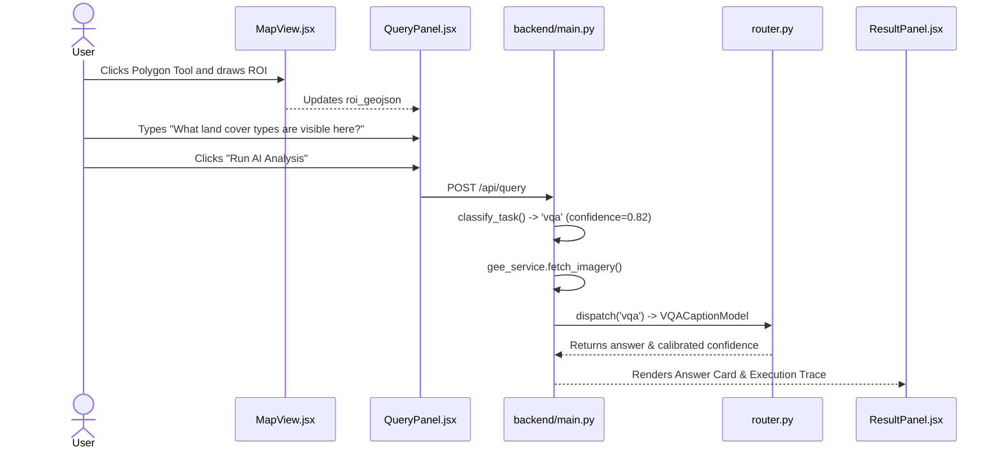

# 15 — Core User Workflows

## Workflow Catalog
1. **Workflow 1:** Draw ROI & Ask Single-Date Question (VQA / Captioning / Grounding)
2. **Workflow 2:** Bi-Temporal Land Cover Change Analysis
3. **Workflow 3:** Multimodal Optical-SAR Fusion Query
4. **Workflow 4:** Upload Local GeoTIFF & Map Overlay
5. **Workflow 5:** Toggle Vector Map Layers (Water, Vegetation, Buildings, Roads)
6. **Workflow 6:** Multi-Format Audit Bundle Export (PDF, GeoJSON, ZIP)

---

## Detailed Step-by-Step Traces

### Workflow 1: Draw ROI & Ask Single-Date Question

* **Step 1:** User zooms into an area of interest (e.g. Jaipur, Rajasthan) on Mapbox.
* **Step 2:** User clicks the polygon drawing icon in the top-right corner and completes a polygon. `MapView.jsx` fires `draw.create` and passes GeoJSON geometry to `App.jsx`.
* **Step 3:** User selects a date range (e.g. `2024-01-01` to `2024-03-31`), selects `Optical` modality, enters a prompt, and clicks **Run AI Analysis**.
* **Step 4:** `App.jsx` invokes `submitQuery()` in `api.js`, which sends `POST /api/query`.
* **Step 5:** `task_classifier.py` classifies the prompt as `vqa`.
* **Step 6:** `gee_service.py` connects to Google Earth Engine, queries Sentinel-2 Level-2A surface reflectance, clips to the polygon, applies cloud masking, and caches a thumbnail.
* **Step 7:** `router.py` invokes `VQACaptionModel.run()`.
* **Step 8:** `aggregator.py` formats the output and execution trace.
* **Step 9:** `ResultPanel.jsx` displays the answer, confidence meter, and execution steps.

---

### Workflow 2: Bi-Temporal Land Cover Change Analysis
* **Trigger:** User toggles dual-date mode in `QueryPanel.jsx` by entering a secondary date range (`dateStart2`, `dateEnd2`) and asking a change question (e.g. *"What has changed between 2023 and 2024?"*).
* **Execution Flow:**
  1. `task_classifier.py` detects presence of `date_start_2` and change keywords, categorizing task as `change_vqa`.
  2. `input_validator.py` confirms two distinct temporal epochs are provided.
  3. `gee_service.py` fetches two Sentinel-2 scenes ($T_1$ and $T_2$).
  4. `router.py` calls both `ChangeVQAModel` and `ChangeSegmentationModel`.
  5. `ChangeVQAModel` analyzes side-by-side temporal images and generates comparative natural-language text.
  6. `ChangeSegmentationModel` and `spectral_indices_service.py` compute $\Delta NDVI$ and $\Delta NDBI$, classifying pixels into `new_construction`, `deforestation`, `vegetation_growth`, and `demolition`.
  7. `aggregator.py` merges the descriptive answer with the spatial GeoJSON polygon evidence.
  8. `ResultPanel.jsx` shows change type chips; `MapView.jsx` renders highlighted change polygons in distinctive colors (Red for construction, Green for vegetation growth).

---

### Workflow 4: Upload Local GeoTIFF & Map Overlay
* **Trigger:** User switches to `Upload Satellite Image` tab and drops a `.tif` file into `ImageUploadPanel.jsx`.
* **Execution Flow:**
  1. `App.jsx` calls `uploadImage(file, onProgress)`.
  2. `POST /api/upload-image` streams file bytes to `backend/services/image_upload_service.py`.
  3. `image_upload_service.py` saves file to `./sessions/{session_id}/upload_{image_id}.tif`.
  4. `rasterio` opens the file, reads embedded coordinate reference system (CRS), and reprojects bounding coordinates to WGS84 (`EPSG:4326`).
  5. Extracts 4-corner coordinates `[[NW], [NE], [SE], [SW]]` and generates a normalized web PNG preview.
  6. `UploadResponse` is returned to React.
  7. `App.jsx` computes `uploadedImageOverlay` and passes it to `MapView.jsx`.
  8. `MapView.jsx` dynamically registers a Mapbox `raster` source and layer, smoothly flying the camera to the exact geographic coordinates of the uploaded image.
