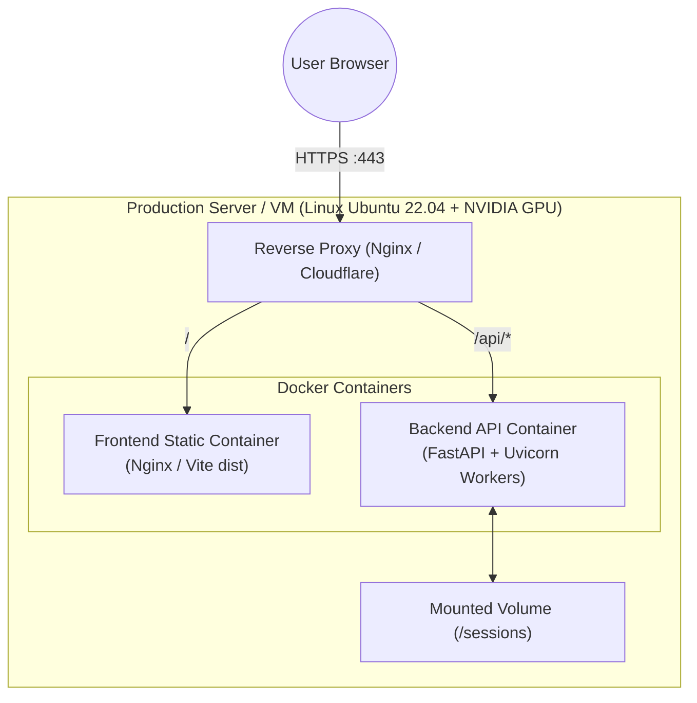

# 21 — Deployment & Production Architecture

## Deployment Models

### 1. Hybrid Container Deployment (Recommended)


---

## Production Dockerfile Example (Backend)

```dockerfile
FROM nvidia/cuda:12.1.0-runtime-ubuntu22.04

WORKDIR /app

# Install system GDAL & Python dependencies
RUN apt-get update && apt-get install -y --no-install-recommends \
    python3-pip \
    python3-dev \
    libgdal-dev \
    build-essential \
    && rm -rf /var/lib/apt/lists/*

COPY backend/requirements.txt .
RUN pip install --no-cache-dir -r requirements.txt

COPY backend/ ./backend/
COPY .env ./backend/.env

EXPOSE 8000

CMD ["uvicorn", "backend.main:app", "--host", "0.0.0.0", "--port", "8000", "--workers", "2"]
```

---

## Production Deployment Checklist
1. **SSL / TLS Termination:** Configure Nginx or Cloudflare to handle SSL certificates on port 443.
2. **Environment Secrets:** Inject `GEE_SERVICE_ACCOUNT_KEY`, `OPENAI_API_KEY`, `HF_TOKEN`, and `VITE_MAPBOX_TOKEN` via Docker environment secrets or Kubernetes Secret objects.
3. **Session Volume:** Mount a persistent volume or shared storage for `./sessions` to retain exported PDF reports across container restarts.
4. **Session Cleanup Cron:** Add a daily cron job to delete session directories older than 48 hours:
   ```bash
   find ./sessions -mindepth 1 -maxdepth 1 -type d -mtime +2 -exec rm -rf {} +
   ```
