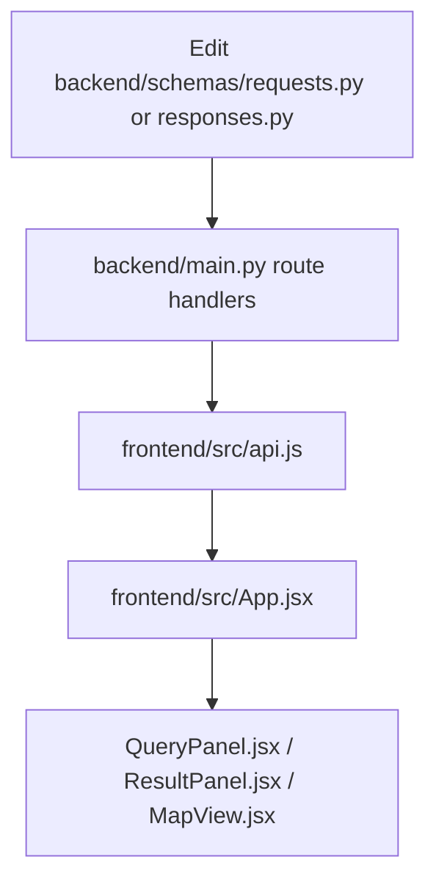
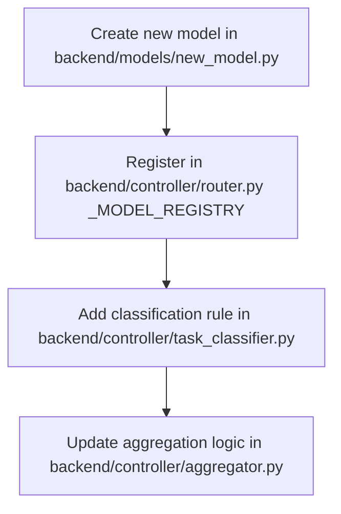

# 27 — Change Impact & Blast Radius Analysis

## Dependency & Modification Impact Chains

### 1. Modifying Request/Response Schemas (`backend/schemas/`)

* **Blast Radius:** High.
* **Compatibility Rule:** Adding optional fields with default values is backward-compatible. Renaming or removing fields breaks frontend parsing in `api.js` and `App.jsx`.

---

### 2. Adding or Replacing a Specialist Model (`backend/models/`)

* **Blast Radius:** Low / Contained.
* **Compatibility Rule:** As long as the new model subclasses `SpecialistModel` (`base_model.py`) and returns `{answer: str, confidence: float, evidence: dict, segmentation_mask: Any}`, `backend/main.py` and the frontend require zero code changes.

---

### 3. Modifying Spectral Indices or Map Layers (`backend/services/`)
* **Blast Radius:** Low.
* **Details:** `spectral_indices_service.py` is called internally by `change_segmentation_model.py`. Any new index added (e.g. Bare Soil Index) can be surfaced by adding a new return metric to the stats dictionary.
